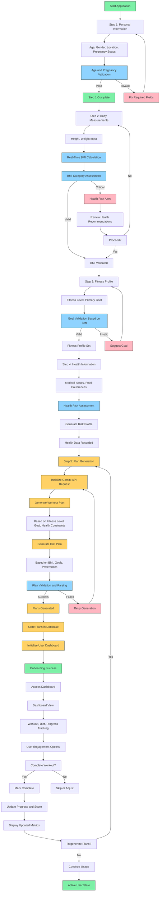

# FitPlan.ai User Onboarding & Plan Generation Workflow

```mermaid
flowchart TD
	A["Start Application"] --> B["Step 1: Personal Information"]
	B --> B1["Age, Gender, Location, Pregnancy Status"]
	B1 --> C["Age and Pregnancy Validation"]

	C -->|Valid| D["Step 1 Complete"]
	C -->|Invalid| E["Fix Required Fields"]
	E --> B

	D --> F["Step 2: Body Measurements"]
	F --> F1["Height, Weight Input"]
	F1 --> G["Real-Time BMI Calculation"]

	G --> H["BMI Category Assessment"]
	H -->|Valid| I["BMI Validated"]
	H -->|Critical| J["Health Risk Alert"]

	J --> K["Review Health Recommendations"]
	K --> L["Proceed?"]
	L -->|Yes| I
	L -->|No| F

	I --> M["Step 3: Fitness Profile"]
	M --> M1["Fitness Level, Primary Goal"]
	M1 --> N["Goal Validation Based on BMI"]

	N -->|Valid| O["Fitness Profile Set"]
	N -->|Invalid| P["Suggest Goal"]
	P --> M

	O --> Q["Step 4: Health Information"]
	Q --> Q1["Medical Issues, Food Preferences"]
	Q1 --> R["Health Risk Assessment"]

	R --> S["Generate Risk Profile"]
	S --> T["Health Data Recorded"]

	T --> U["Step 5: Plan Generation"]
	U --> V["Initialize Gemini API Request"]

	V --> W["Generate Workout Plan"]
	W --> W1["Based on Fitness Level, Goal, Health Constraints"]

	W1 --> X["Generate Diet Plan"]
	X --> X1["Based on BMI, Goals, Preferences"]

	X1 --> Y["Plan Validation and Parsing"]

	Y -->|Success| Z["Plans Generated"]
	Y -->|Failed| AA["Retry Generation"]
	AA --> V

	Z --> AB["Store Plans in Database"]
	AB --> AC["Initialize User Dashboard"]

	AC --> AD["Onboarding Success"]
	AD --> AE["Access Dashboard"]

	AE --> AF["Dashboard View"]
	AF --> AF1["Workout, Diet, Progress Tracking"]

	AF1 --> AG["User Engagement Options"]
	AG --> AH["Complete Workout?"]

	AH -->|Yes| AI["Mark Complete"]
	AH -->|No| AJ["Skip or Adjust"]

	AI --> AK["Update Progress and Score"]
	AK --> AL["Display Updated Metrics"]

	AL --> AM["Regenerate Plans?"]
	AM -->|Yes| U
	AM -->|No| AN["Continue Usage"]

	AN --> AO["Active User State"]

	style A fill:#7CF0A6,stroke:#1E2B22,stroke-width:1px
	style D fill:#7CF0A6,stroke:#1E2B22,stroke-width:1px
	style AD fill:#7CF0A6,stroke:#1E2B22,stroke-width:1px
	style AO fill:#7CF0A6,stroke:#1E2B22,stroke-width:1px

	style C fill:#8FD3FF,stroke:#1E2B22,stroke-width:1px
	style G fill:#8FD3FF,stroke:#1E2B22,stroke-width:1px
	style H fill:#8FD3FF,stroke:#1E2B22,stroke-width:1px
	style N fill:#8FD3FF,stroke:#1E2B22,stroke-width:1px
	style R fill:#8FD3FF,stroke:#1E2B22,stroke-width:1px
	style Y fill:#8FD3FF,stroke:#1E2B22,stroke-width:1px

	style U fill:#FFD166,stroke:#1E2B22,stroke-width:1px
	style V fill:#FFD166,stroke:#1E2B22,stroke-width:1px
	style W fill:#FFD166,stroke:#1E2B22,stroke-width:1px
	style X fill:#FFD166,stroke:#1E2B22,stroke-width:1px
	style Z fill:#FFD166,stroke:#1E2B22,stroke-width:1px
	style AB fill:#FFD166,stroke:#1E2B22,stroke-width:1px
	style AC fill:#FFD166,stroke:#1E2B22,stroke-width:1px

	style E fill:#FFB6C1,stroke:#1E2B22,stroke-width:1px
	style J fill:#FFB6C1,stroke:#1E2B22,stroke-width:1px
	style P fill:#FFB6C1,stroke:#1E2B22,stroke-width:1px
	style AA fill:#FFB6C1,stroke:#1E2B22,stroke-width:1px
```
