# VISUAL_WORKFLOW.md - Interactive Workflow Diagrams

Visual diagrams showing the complete workflow of Fitplan.ai using Mermaid syntax.

## 🔄 Complete User Journey Flowchart

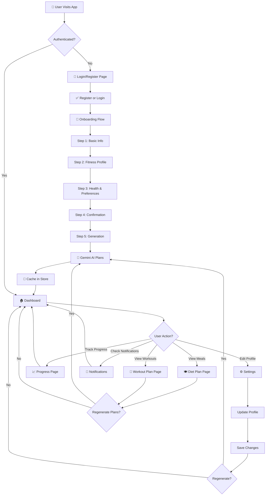

## 🔐 Authentication & Data Flow

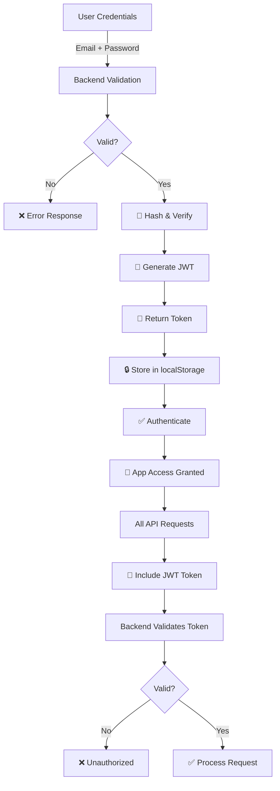

## 📝 Onboarding 5-Step Process

```mermaid
flowchart LR
    A["🎬 Start"] --> B["Step 1<br/>Basic Info"]
    B -->|Name, Email, Age, Gender| C["Step 2<br/>Fitness Profile"]
    C -->|Height, Weight, Level, Goal| D["Step 3<br/>Health & Prefs"]
    D -->|Location, Health Issues<br/>Food Preference| E["Step 4<br/>Confirmation"]
    E -->|Review & Edit| F["Step 5<br/>Generation"]
    F -->|Generating...| G["🤖 AI Plans"]
    G -->|Cached| H["✅ Dashboard"]
    
    style A fill:#e1f5ff
    style B fill:#fff3e0
    style C fill:#fce4ec
    style D fill:#f3e5f5
    style E fill:#e0f2f1
    style F fill:#ede7f6
    style H fill:#c8e6c9
```

## 🍽️ Diet Plan Generation Flow

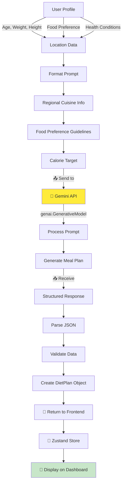

## 💪 Workout Plan Generation Flow

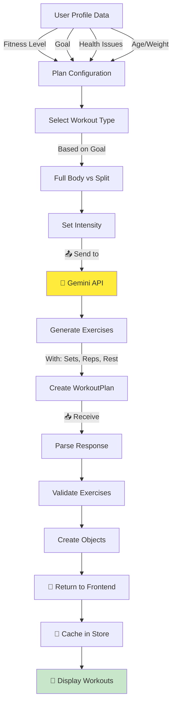

## 🏠 Dashboard Home Layout

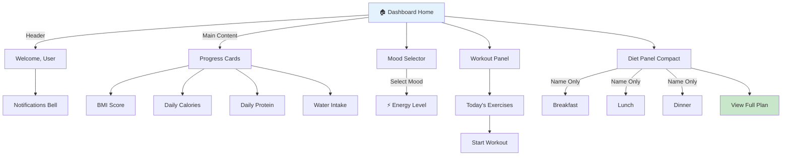

## 🍽️ Diet Plan Page Details

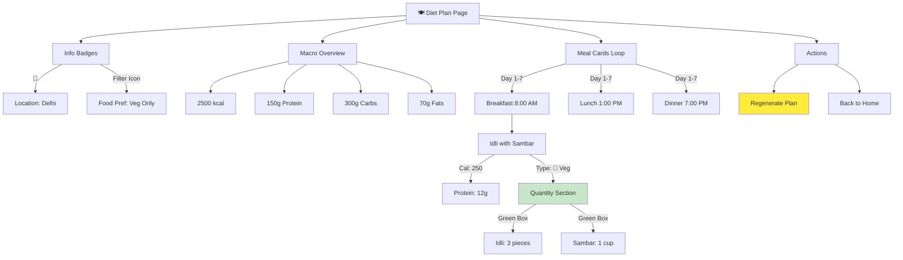

## ⚙️ Settings & Profile Update Flow

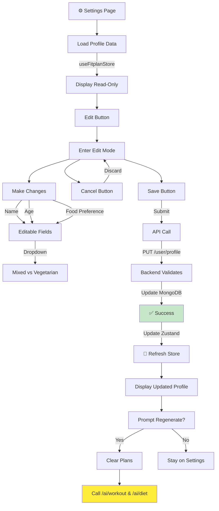

## 🔄 State Management Flow

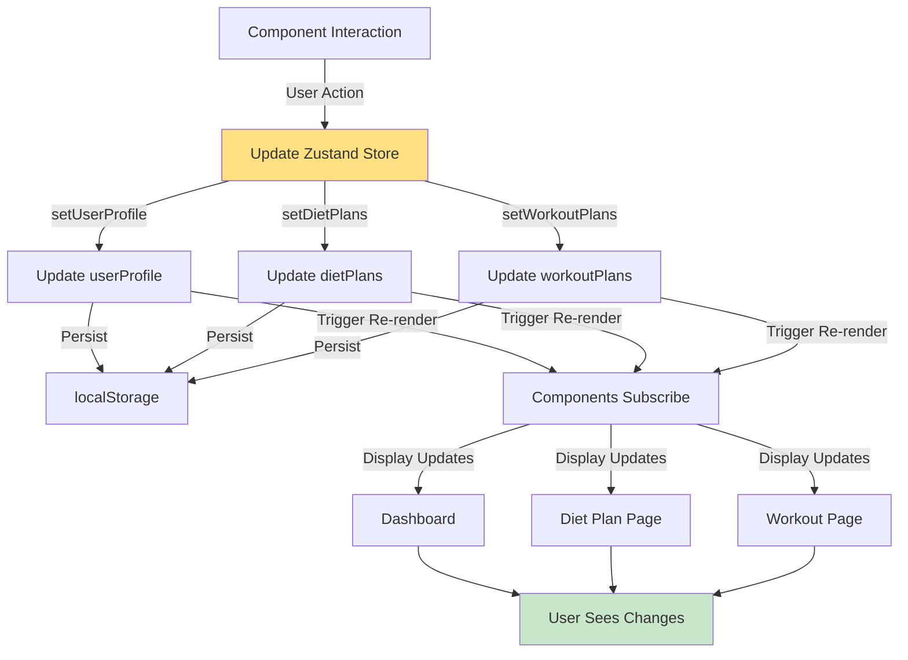

## 🗄️ Database Schema Relationships

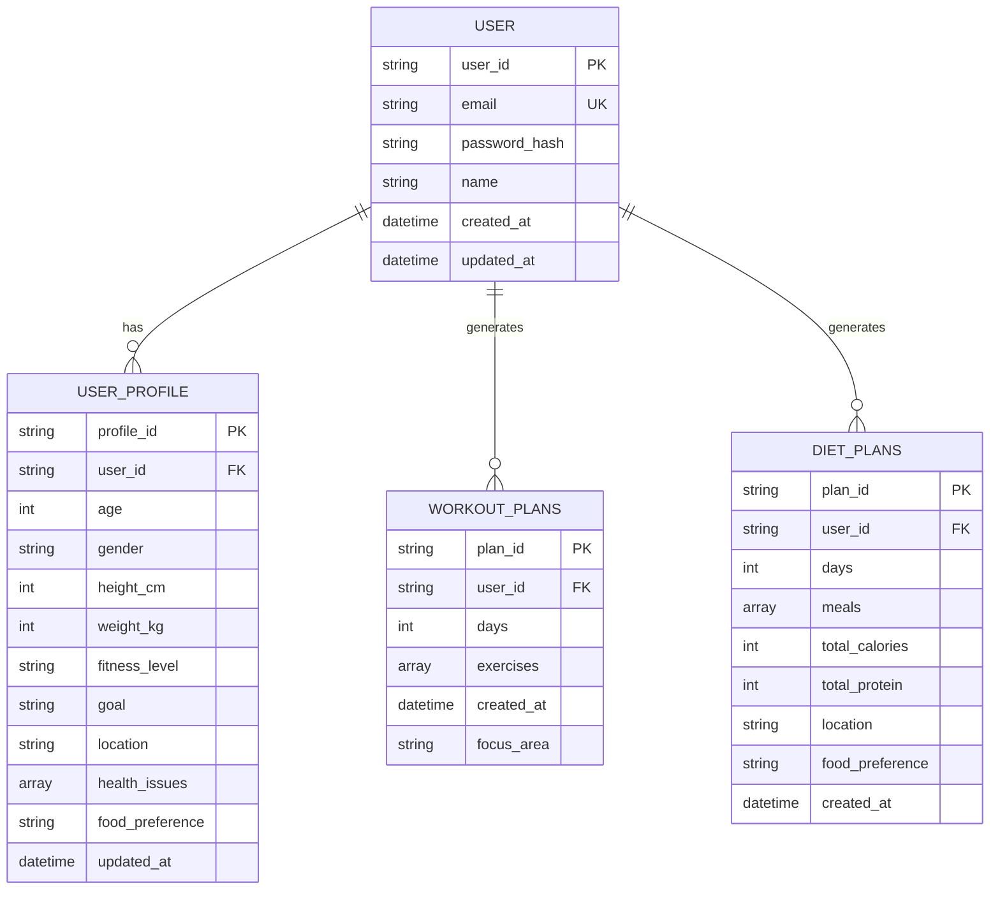

## 🔌 API Endpoints Map

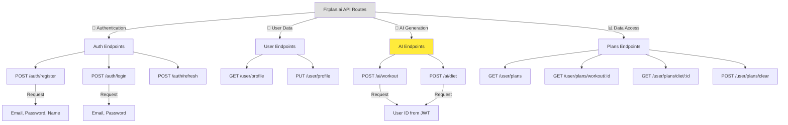

## 📱 UI Component Hierarchy

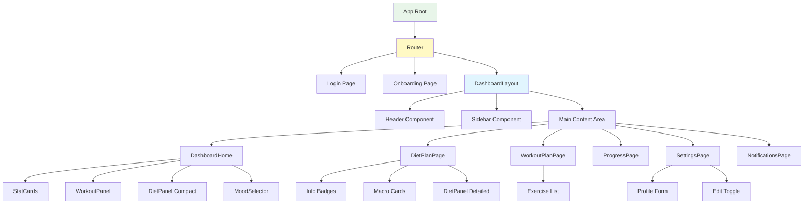

## 🌐 Frontend-Backend Communication

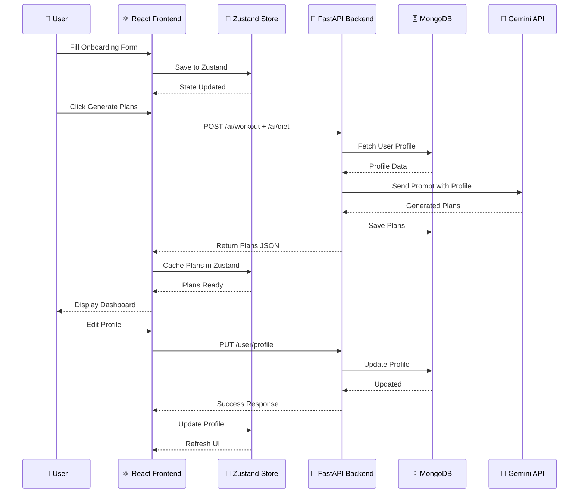

## 🎯 Feature Usage Flow

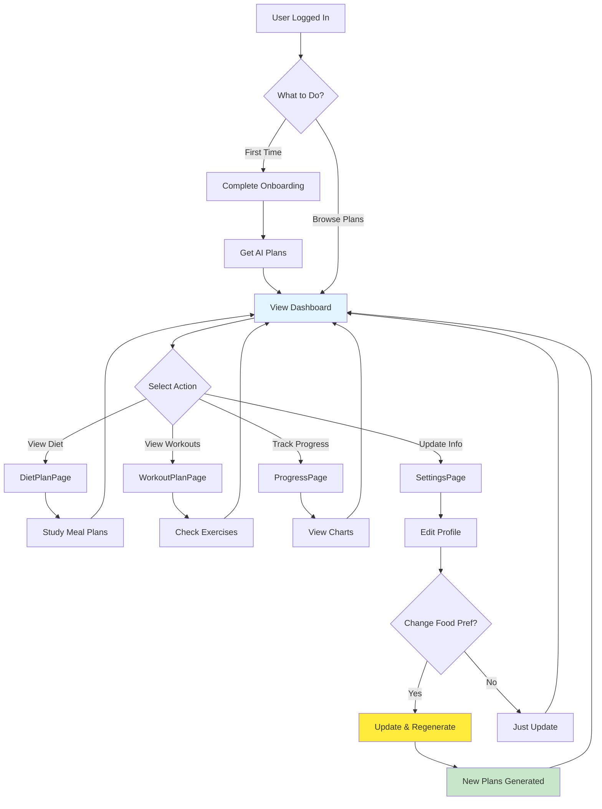

## 📊 Data Flow Summary

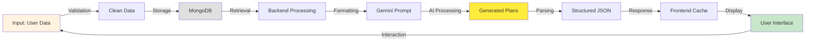

---

**Visual Workflow Version**: 1.0  
**Last Updated**: February 2026  
**Format**: Mermaid Diagrams for VS Code & GitHub
